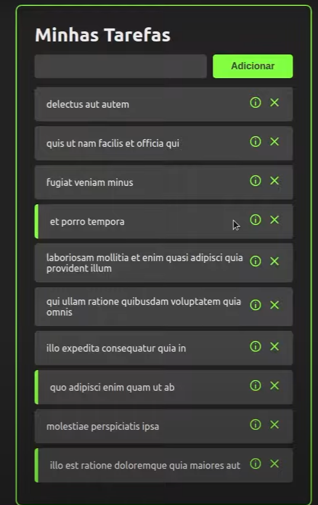
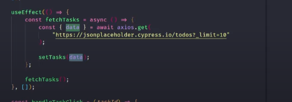
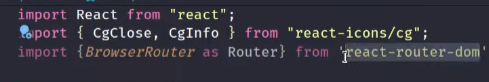
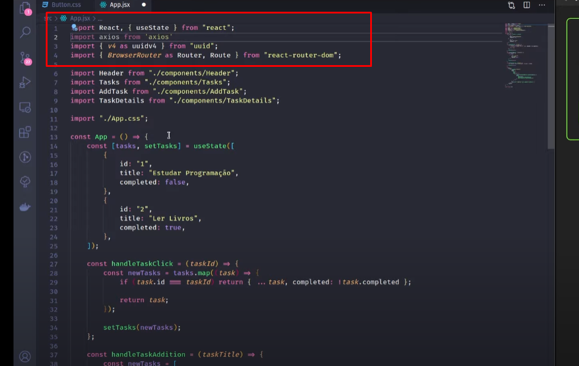

###Projeto: 
Minhas tarefas! focado em React e Javascript
React é  uma biblioteca para criar interfaces de usuários/ conceito de componentes /faça uma vez use toda hora! !

[Alt text](image.png)
=======================================================================================
### Foi visto neste projeto: 
React e Javascript : useState>: 
O useState é um hook do React que permite adicionar estado a componentes funcionais. Antes dos hooks, os componentes funcionais no React não tinham estado interno. Com o useState, você pode declarar variáveis de estado dentro de seus componentes, permitindo que eles mantenham e atualizem o estado local.A função useState retorna um array com dois elementos:
O primeiro elemento é o valor atual do estado.
O segundo elemento é uma função que permite modificar esse estado.

### PROPS:
As props são um objeto que contém propriedades e valores associados a essas propriedades/As props são uma maneira eficiente e flexível de transmitir dados entre componentes em uma aplicação React, permitindo uma composição modular e reutilização de componentes.
=====================================================================================

### UuseParams:
 No contexto do React Router, o hook useParams é usado para acessar os parâmetros passados em uma URL. Quando você define um parâmetro em uma rota usando o caractere : na configuração da rota, o valor desse parâmetro pode ser acessado por meio do useParams no componente correspondente.
 Se a URL for /user/johndoe, o useParams no componente UserProfile irá retornar um objeto com a propriedade username contendo o valor "johndoe". Você pode então usar esse valor para renderizar dinamicamente o conteúdo do componente com base no valor do parâmetro na URL.
Isso é particularmente útil quando você precisa criar componentes reutilizáveis que dependem de dados específicos na URL, como detalhes do usuário, IDs de postagem, etc. O useParams facilita a extração desses valores da URL no componente.

====================================================================================
### useNavigation
é usado para obter o objeto de navegação, e a função navigate é usada para navegar para uma tela específica quando o botão é pressionado. Lembre-se de substituir 'NomeDaSuaTela' pelo nome real da tela para a qual você deseja navegar.

====================================================================================
### useEffect
é um hook em React que permite que você realize efeitos colaterais em componentes funcionais. Pode ser usado para executar código em resposta a mudanças no estado, propriedades ou durante a montagem/desmontagem do componente.
O primeiro useEffect é executado apenas uma vez após a montagem do componente devido ao segundo argumento, a array vazia [].
O segundo useEffect é executado sempre que o estado dados é alterado.
Você pode ajustar o segundo argumento do useEffect conforme necessário, dependendo de quando você deseja que o efeito seja disparado. Se você passar uma array vazia, ele será executado apenas uma vez (equivalente ao componentDidMount em componentes de classe). Se você passar uma array de dependências, o efeito será executado sempre que essas dependências mudarem. Se você omitir o segundo argumento, o efeito será executado após cada renderização.

===================================================================================
iniciando o projeto: 
- Vscode:Extesoes: Simple react Snippets/ Prettier code format
- React 
- Node.js
Bibliotecas: 
npm install uuid (gerar id aleatorio)
npm install react-icons --save (Alguns icones para aplicação)

IMPORTAÇÃO DA BIBLIOTECA AXIOS para chamda da api 
API = https://jsonplaceholder.cypress.io/todos?_limit=10

